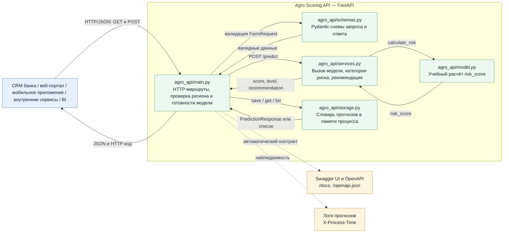

# Практическая работа №1 — REST API для AI-сервиса на FastAPI

## Архитектура

### Потребители
- CRM банка
- Web-портал
- мобильное приложение
- внутренние банковские системы
- BI-система

### Протокол
HTTP/REST + JSON.

### Инференс
Синхронный запрос POST /predict.

### Хранение
In-memory storage для лабораторного прототипа.

### Логирование и наблюдаемость
- logging;
- request_id;
- X-Process-Time;
- HTTP-коды;
- OpenAPI/Swagger.

## Структура

```text
agro_api/
├── __init__.py
├── main.py       # FastAPI и endpoints
├── schemas.py    # Pydantic-модели
├── model.py      # расчёт risk score
├── services.py   # postprocessing и бизнес-логика
└── storage.py    # временное in-memory хранилище
```

## Запуск

```bash
python -m venv .venv
# Windows:
.venv\\Scripts\\activate
# Linux/macOS:
source .venv/bin/activate
pip install -r requirements.txt
uvicorn agro_api.main:app --reload
```

Swagger: http://127.0.0.1:8000/docs

## Endpoints

- `GET /health`
- `GET /model-info`
- `POST /predict`
- `GET /predictions/{request_id}`
- `GET /predictions?limit=10&risk_level=high`

## Тесты

```bash
pytest -q
```

## Компонентная схема

Исходник диаграммы также находится в [`architecture.mmd`](architecture.mmd), а HTML-версия — в [`architecture.html`](architecture.html).


